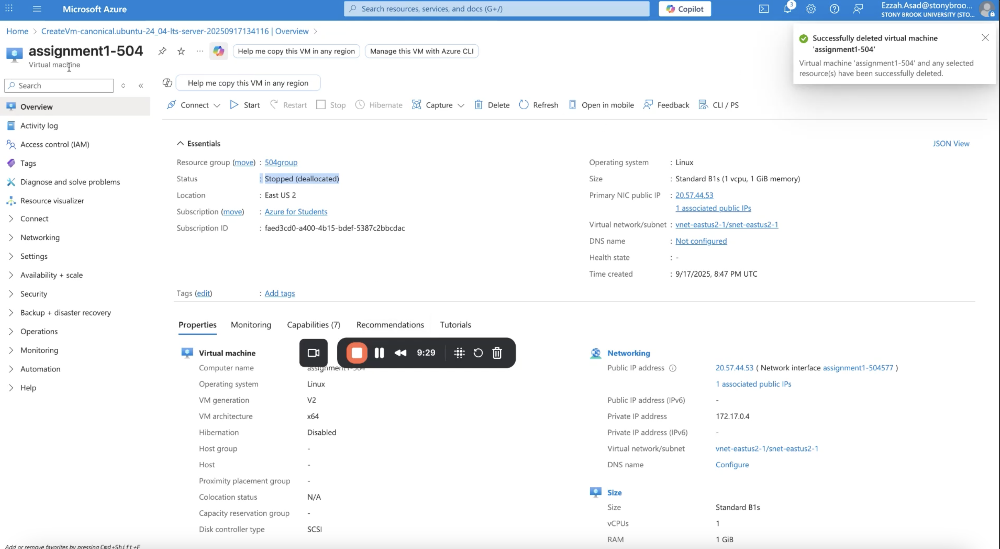

# VM Lifecycle on GCP and Azure — Tutorial

## Video
Loom/Zoom: <paste link>

## Prereqs
- Cloud access to GCP and Azure
- No PHI/PII; smallest/free-tier shapes

---

## Google Cloud (GCP)
### Create
1. Console → Compute Engine → Create instance
2. Region/zone: us-east4 (Northern Virginia)
3. Machine type: e2-micro
4. Image: Ubuntu 25.04 Minimal
5. Boot disk: default minimal
6. Network: default VPC; ephemeral public IP

### Start/Stop
- Start: 

- Stop: <state shows TERMINATED/STOPPED>
[GCP stop](images/gcp_stopped.png)

### Delete
- Delete instance and verify no disks/IPs remain

---

## Azure
### Create
1. Compartment: virtual machine -> create 
2. region/availability zone:  (US) East US 2
3. Machine Size:  <smallest/free-eligible>
4. Image: Ubuntu (or Oracle Linux)
5. Authentication type: password
6. Boot volume: default minimal

### Start/Stop
- Start: <state shows RUNNING>

- Stop: <state shows STOPPED>

### Terminate
- Terminate and delete boot volume; verify cleanup

---
## Reflections
### Similarities
- Both had the Ubuntu LTS that I used for my assignment (and other Linux distros) for lightweight testing.
Both asked you to identify a region and zone for where the VM runs. 
The setup process was similar because both platforms guide you through multiple sections step by step to create the VM.
Indicated status of the computer. (Running, stopped, terminated)

### Differences
-Azure has a “resources group” whereas GCP did not organize the VMs and other related assets. 
Azure allows you to pick the Virtual Network and subnet, and GCP gives you a default VPC network. 
Azure presents more configuration steps and are less hidden than GCP.
Azure assigns a public IP that can persist, while GCP typically uses a temporary IP that’s released once the VM is deleted.

### Preference (Azure vs GCP) and Why
- As a beginner, I found myself to prefer GCP over Azure because it was more straightforward and clear. As briefly mentioned in contrasting the two above, I saw that GCP had more pre-configured defaults already set which made the whole process feel cleaner and less overwhelming since I could create a VM quickly without having to worry about any excess configuration. Although I did leave many things at default in Azure, there were more options presented to me to read through. Since the tabs were structured in sequential order, I found myself spending more time clicking and reading through the sections even if I was not changing much. While this could be useful for someone with more experience, I found myself a little more confused when creating the VM. I believe since GCP had more different settings across the hamburger, you had to click around more if you wanted to customize, and that made the process for creating and running a VM feel more approachable. 